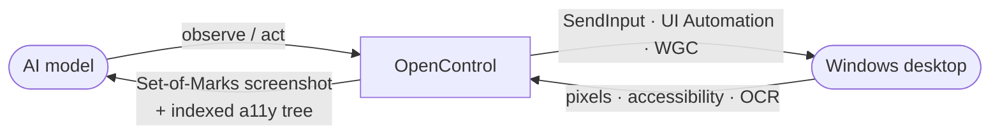
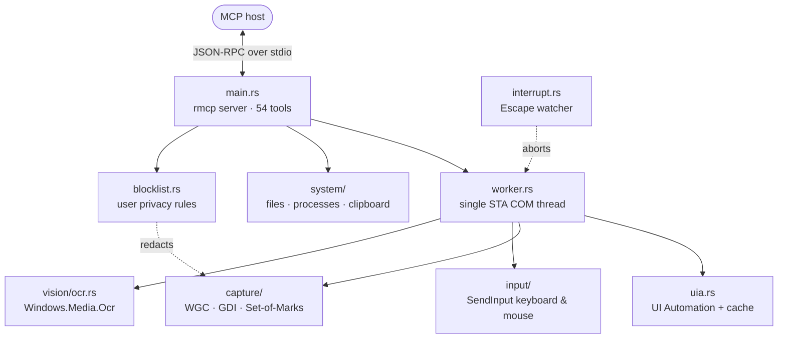

<div align="center">


# OpenControl

**Give any AI real hands on a Windows PC.**

A single ~2 MB Rust binary that speaks the [Model Context Protocol](https://modelcontextprotocol.io).
No Python. No browser driver. No cloud. Just **54 native tools** for seeing and controlling the desktop.

[](https://www.rust-lang.org)
[](#requirements)
[](https://modelcontextprotocol.io)
[](#tool-catalog)
[](#performance--footprint)
[](LICENSE)

[Quick start](#quick-start) · [How it works](#how-it-works) · [Tools](#tool-catalog) · [Compare](#how-it-compares) · [Privacy](#privacy--app-blocking) · [Architecture](#architecture) · [Safety](#safety--control)

</div>

---

<br>**OpenControl** is a Model Context Protocol (MCP) server that gives a language model real hands on a
Windows machine. It can see the screen, read the accessibility tree, move the mouse, type, manage
windows, run commands, and recognize on-screen text with built-in OCR.

The entire server ships as **one self-contained executable written in Rust**. There is no Python
runtime, no Node, no browser automation framework, and no cloud round-trip. Point any MCP host
(Claude Desktop, VS Code, Cursor, or your own agent) at a single binary, and it can drive the desktop
directly.

## Why OpenControl

- **One binary, zero runtime dependencies.** A ~2 MB native executable. Nothing to `pip install`, no
  virtual environment, no Node modules. Build it once, copy it anywhere, run it.
- **Sees like a human, acts like a program.** Every `observe` returns a *Set-of-Marks* screenshot
  (numbered boxes drawn over controls) **and** a compact UI Automation tree in which each control
  carries a stable `[index]`, its center point, and the actions it supports. The model acts by index,
  the most reliable form of GUI grounding, with pixels only as a fallback.
- **Built-in OCR, nothing to install.** On-screen text recognition via `Windows.Media.Ocr`, returning
  per-word boxes in screen coordinates, for canvases, games, and anything the accessibility tree misses.
- **Accurate, DPI-aware capture.** Windows.Graphics.Capture and GDI with correct handling of
  multi-monitor layouts, display scaling, and negative coordinates.
- **Fast where it counts.** Bulk UI Automation caching turns a 400-element tree from ~415 ms into
  ~106 ms (about 4×). Screenshots default to JPEG capped at 1568 px so each step stays light on tokens.
- **You stay in control.** Press the physical **Escape** key at any moment to abort the in-flight
  action and signal the agent to stop.
- **Block apps from the AI.** A user-owned blocklist (by exe name, path, window title, or class) keeps
  chosen apps private: matching windows are **redacted** from every screenshot and OCR result and
  **refused** for control. See [Privacy & app blocking](#privacy--app-blocking).
- **54 native tools** spanning capture, mouse, keyboard, windows, accessibility, OCR, processes,
  clipboard, files, timing, and privacy.

## How it works

The agent runs a tight perception-action loop. A single `observe` call gives it both the picture and
the structured truth of the screen; it then acts on controls by their index instead of guessing pixels.



1. **Find a target**: `list_windows` (or `list_apps`) locates the window to drive.
2. **Observe**: `observe(window_handle)` returns, in one call, a numbered Set-of-Marks screenshot plus
   an indexed accessibility tree.
3. **Act by index**: `click_element`, `set_element_value`, or `invoke_element` operate directly on a
   control's `[index]`. No pixel math, no misclicks.
4. **Fall back when needed**: for canvas or game UIs with no accessibility data, drop to
   `take_screenshot` + coordinate `click`/`drag`, or use `ocr` / `find_text` to locate text on screen.

## Quick start

### Requirements

- **Windows 10 or 11** (64-bit). The server uses Win32 and WinRT APIs and builds on Windows.
- **Rust 1.70+** (stable toolchain). [Install via rustup](https://rustup.rs/).

### Build

```powershell
git clone https://github.com/JoshuaALawrence/OpenControl.git
cd OpenControl
cargo build --release        # or: .\build.cmd release
```

The result is a single self-contained binary at `target\release\OpenControl.exe` (~2 MB).

### Register with your MCP host

**VS Code.** Add to `.vscode/mcp.json` (workspace) or your user `mcp.json`:

```json
{
  "servers": {
    "computer-use": {
      "type": "stdio",
      "command": "${workspaceFolder}/target/release/OpenControl.exe"
    }
  }
}
```

**Claude Desktop.** Add to `claude_desktop_config.json`:

```json
{
  "mcpServers": {
    "computer-use": {
      "command": "C:\\path\\to\\OpenControl\\target\\release\\OpenControl.exe"
    }
  }
}
```

More samples live in [examples/mcp.json](examples/mcp.json). After editing the config, fully restart
the client so it relaunches the server.

## Example prompts

Once connected, hand the agent goals in plain language:

- *"Take a screenshot and tell me which windows are open."*
- *"Open Notepad, write a haiku about Rust, and save it to my Desktop as `rust.txt`."*
- *"In the Settings window, use observe to find the Bluetooth toggle and turn it on."*
- *"Read all the text visible on my screen right now."*
- *"Find the Save button and click it by its index."*

Behind the scenes the agent will `launch_app`, `observe` for an indexed tree, then act with
`click_element`, `type_text`, or `set_element_value`, falling back to coordinates or OCR only when a
control has no accessibility data.

## Tool catalog

54 tools, grouped by what they do. Coordinates are always **image-space** (origin at the top-left of
the most recent screenshot) and are mapped back to physical pixels internally, so clicks stay accurate at
any capture scale or DPI.

### Vision & screen capture

| Tool | Description |
| --- | --- |
| `screen_info` | List the monitor layout and virtual-desktop bounds. |
| `take_screenshot` | Capture a monitor, region, or the whole virtual desktop, with optional grid and cursor overlays. |
| `zoom` | Magnify a region and return it at native resolution so small text and icons are legible. |
| `get_pixel_color` | Read the RGB/hex color of a pixel from the last screenshot. |
| `get_cursor_position` | Return the mouse position in physical screen pixels. |
| `save_screenshot` | Capture the screen (or a region) and save it to a `.png` on disk. |

### Accessibility: see and act semantically

| Tool | Description |
| --- | --- |
| `observe` | **Primary tool.** Capture a window plus its indexed accessibility tree in one call (Set-of-Marks + actions per control). |
| `click_element` | Click a control by its `[index]` (moves the real mouse, or invokes it if off-screen). |
| `set_element_value` | Set an editable control's value via the ValuePattern. Faster and more reliable than typing. |
| `invoke_element` | Invoke a control without the mouse: invoke, toggle, expand, collapse, select, or scroll. |
| `get_ui_tree` | Dump an indexed accessibility tree as text (no screenshot) for a window or the whole desktop. |
| `find_elements` | Search a window's tree for controls by name and/or control type; returns usable indices. |
| `get_focused_element` | Return the control that currently holds keyboard focus. |
| `get_element_at_point` | Identify the UI element under an image-space point. |

### OCR & image matching

| Tool | Description |
| --- | --- |
| `ocr` | Read on-screen text with built-in Windows OCR; returns text plus per-word boxes in screen pixels. |
| `find_text` | Locate on-screen text and return matching words with clickable centers. |
| `find_image_on_screen` | Find a template image via normalized cross-correlation; returns matches with centers. |

### Mouse

| Tool | Description |
| --- | --- |
| `move_mouse` | Move the cursor without clicking. |
| `click` | Click at a point: `left`/`right`/`middle`, single/double/triple. |
| `double_click` | Double-click at a point. |
| `right_click` | Right-click to open a context menu. |
| `drag` | Press, drag, and release for sliders, selections, and drag-and-drop. |
| `scroll` | Scroll the wheel over a point, vertically or horizontally. |
| `mouse_button` | Fine-grained button `down`/`up` for custom press-hold-release sequences. |

### Keyboard

| Tool | Description |
| --- | --- |
| `type_text` | Type Unicode text into the focused control, with an optional per-key delay. |
| `press_key` | Press a `+`-separated chord using keysym names (e.g. `Control_L+a`, `Alt_L+F4`). |
| `hotkey` | Alias of `press_key` for chord shortcuts. |
| `key_combo_sequence` | Press a sequence of chords in order (e.g. `["alt+f", "s"]`). |
| `hold_key` | Hold a set of keys down for a duration, then release. |
| `list_key_names` | List every accepted keysym-style key name. |

### Windows & apps

| Tool | Description |
| --- | --- |
| `list_windows` | List targetable top-level windows: handle, title, and owning app. |
| `list_apps` | List installed apps (from Start Menu shortcuts) with running state and open windows. |
| `get_active_window` | Return the foreground window's handle, title, and app. |
| `focus_window` | Bring a window to the foreground and give it focus. |
| `window_state` | Minimize, maximize, or restore a window. |
| `move_resize_window` | Move and resize a window to an absolute rectangle. |
| `close_window` | Request a window to close (the app may prompt to save). |
| `set_window_topmost` | Pin a window above all others, or unpin it. |
| `launch_app` | Launch an app by executable path or shell identifier (e.g. `notepad`, `ms-settings:`). |

### System & processes

| Tool | Description |
| --- | --- |
| `run_powershell` | Run a PowerShell script and return stdout/stderr/exit code (bounded). |
| `run_command` | Run an executable with arguments and return its output. |
| `get_system_info` | Report host OS, CPU, memory, monitors, and virtual-screen size. |
| `list_processes` | List running processes (pid + name), optionally filtered. |
| `kill_process` | Terminate a process by pid or name. *(Destructive; use deliberately.)* |

### Privacy & access control

| Tool | Description |
| --- | --- |
| `get_blocklist` | Show the user-configured application blocklist (read-only). Reports which apps are redacted from captures/OCR and refused for control. The agent cannot change it. |

### Clipboard

| Tool | Description |
| --- | --- |
| `get_clipboard` | Read clipboard text. |
| `set_clipboard` | Set clipboard text. |
| `paste` | Optionally set text, then paste with Ctrl+V. |
| `copy_selection` | Copy the current selection and return the resulting clipboard text. |

### Files

| Tool | Description |
| --- | --- |
| `read_file` | Read a UTF-8 text file (bounded). |
| `write_file` | Write a UTF-8 text file. |
| `list_directory` | List the entries of a directory. |

### Timing & synchronization

| Tool | Description |
| --- | --- |
| `wait` | Pause for a number of seconds to let the UI settle. |
| `wait_for_screen_change` | Block until the screen changes or a timeout elapses. Ideal after an action whose duration is unknown. |

## How it compares

Most computer use tooling pokes at pixels guessed from a screenshot. OpenControl leads with the
accessibility tree and keeps pixels and OCR as fallbacks, so the agent rarely misclicks.

| | Pixel-only automation | OpenControl |
| --- | --- | --- |
| **Grounding** | Coordinates guessed from an image | Indexed accessibility tree + Set-of-Marks; pixels as fallback |
| **On-screen text** | Bolt-on OCR pipeline | Built-in Windows OCR with per-word boxes |
| **Multi-monitor & DPI** | Frequently breaks | Handled: scaling and negative coordinates |
| **Runtime dependencies** | Python, venv, Tesseract, drivers | None, just one native binary |
| **Footprint** | 100+ MB | ~2 MB |
| **Human override** | Varies | Physical Escape aborts instantly |

## Privacy & app blocking

You can stop the AI from ever seeing or touching specific applications. The blocklist is a
**user-owned control**: it is loaded once at startup and **cannot be modified by the agent**. When any
rule is active, a matching window is:

- **Redacted from every capture** — `take_screenshot`, `zoom`, `save_screenshot`, `ocr`, `find_text`,
  and `find_image_on_screen` paint the window's pixels out *before* the image is encoded, scanned, or
  written to disk, so blocked content never reaches the model (not even as recognized text).
- **Filtered from listings** — `list_windows`, `list_apps`, and `get_active_window` omit it.
- **Refused for control** — `observe`, `focus_window`, `close_window`, `move_resize_window`,
  `window_state`, `set_window_topmost`, `find_elements`, `get_ui_tree`, `get_element_at_point`,
  `get_focused_element`, and `launch_app` return an error for a blocked target.

Redaction is z-order aware: windows stacked above a blocked one are subtracted from the masked region,
and its menus/popups are masked too. If nearly the whole frame is blocked the capture is blanked
entirely, and (by default, *fail-closed*) a capture is refused outright if window enumeration fails.

### Configure it

Rules come from a JSON config file and/or environment variables. Quickest is an env var on the server
entry in your MCP host config (values are `;`- or `,`-separated):

```json
{
  "servers": {
    "computer-use": {
      "type": "stdio",
      "command": "${workspaceFolder}/target/release/OpenControl.exe",
      "env": {
        "OPENCONTROL_BLOCK_EXE": "KeePass.exe; Bitwarden.exe",
        "OPENCONTROL_BLOCK_TITLE": "*Password*; *Incognito*"
      }
    }
  }
}
```

For finer control (per-rule blur, exact class names, a custom color), use a config file at
`%APPDATA%\OpenControl\blocklist.json` (or point `OPENCONTROL_BLOCKLIST` at any path):

```json
{
  "fail_closed": true,
  "default_mode": { "type": "solid", "color": "#000000" },
  "rules": [
    { "exe_name": "KeePass.exe" },
    { "exe_path": "1Password" },
    { "title": "*Incognito*", "mode": { "type": "blur", "sigma": 24 } },
    { "class_name": "Chrome_WidgetWin_1", "title": "*Bitwarden*" }
  ]
}
```

Matching is case-insensitive. Within a rule every populated field must match (logical **AND**);
separate rules are **OR**-ed. `title` is a substring match, or a `*`-wildcard glob when it contains
`*`. Each rule may set its own redaction `mode` (`solid` with a hex `color`, or `blur` with a `sigma`
of 1–200); otherwise `default_mode` applies. The agent can inspect (but not change) the active rules
via the `get_blocklist` tool.

## Architecture



Everything that touches UI Automation, capture, or input is funneled through a **single STA COM
worker thread**, so the indexed-element registry stays consistent across calls and there is no
cross-thread COM marshaling to fight. The async MCP surface sits on Tokio in front of it.

| Path | Role |
| --- | --- |
| [src/main.rs](src/main.rs) | rmcp server; defines all 54 `#[tool]` methods; stdio transport. |
| [src/worker.rs](src/worker.rs) | Single STA COM thread; marshals every UIA/capture/input call. |
| [src/uia.rs](src/uia.rs) | UI Automation tree with bulk caching, stable indices, and control patterns. |
| [src/capture/](src/capture) | Windows.Graphics.Capture + DPI-aware GDI; Set-of-Marks / grid / cursor annotation; blocklist redaction; scaling; PNG/JPEG encode. |
| [src/blocklist.rs](src/blocklist.rs) | User privacy rules: parsing, app/window matching, and redaction policy. |
| [src/input/](src/input) | SendInput-based Unicode keyboard & mouse; X11 keysym names. |
| [src/vision/ocr.rs](src/vision/ocr.rs) | Windows.Media.Ocr on a dedicated MTA thread (avoids STA re-entrancy deadlock). |
| [src/system/](src/system) | System info, clipboard, processes, files, PowerShell/commands, installed-app discovery. |
| [src/interrupt.rs](src/interrupt.rs) | Global Escape-key watcher that aborts in-flight actions. |

**Tech stack:** Rust 2021 · [rmcp](https://crates.io/crates/rmcp) 1.7.0 (the official Rust MCP SDK) ·
[tokio](https://tokio.rs) · [windows](https://crates.io/crates/windows) (Win32 + WinRT) ·
[image](https://crates.io/crates/image) · [schemars](https://crates.io/crates/schemars).

## Performance & footprint

| Metric | Value |
| --- | --- |
| Binary size | ~2 MB, statically self-contained |
| Tool dispatch | Sub-millisecond (in-process; no IPC hop) |
| 400-element accessibility tree | ~106 ms (≈4× faster via bulk UIA caching) |
| Default screenshot | JPEG, quality 82, long edge ≤ 1568 px |

The release profile is tuned for size and speed: `opt-level = "z"`, link-time optimization, a single
codegen unit, and stripped symbols. Prefer `observe` for repeated interaction (the tree is cheaper and
more reliable than re-screenshotting), and bound `region` on `ocr` / `find_image_on_screen` for speed.

## Safety & control

- **Hard stop.** Pressing the physical **Escape** key aborts the current action and tells the agent to
  stop, a human override that never depends on the model cooperating.
- **Block apps from the agent.** The user-owned [blocklist](#privacy--app-blocking) redacts chosen
  windows from captures and refuses control of them, independent of model cooperation.
- **It runs as you.** OpenControl acts with your user privileges and can control the entire session.
  Only connect it to agents and prompts you trust. Tools such as `run_powershell`, `run_command`, and
  `kill_process` are intentionally powerful.
- **No telemetry, no network of its own.** The server speaks MCP over stdio to its host and opens no
  outbound connections. It retains nothing unless you explicitly call `save_screenshot` or `write_file`.
- **Your model's policy still applies.** Anything you share with a cloud model (screenshots, text) is
  governed by that provider's privacy terms, not OpenControl's.
- **Copyleft license.** Distributed under AGPL-3.0. See [License](#license).

## Development

```powershell
.\build.cmd release     # build the release binary (or: cargo build --release)
.\build.cmd test        # unit + integration tests
make lint               # cargo fmt --check + clippy
```

A stdlib-only Python MCP smoke test is included: `py tests\mcp_rust_test.py` (build the binary first).
The privacy/redaction feature has a dedicated end-to-end smoke: `.\tests\redaction-smoke.ps1`.
Continuous integration runs the test suite, Clippy, formatting, and a security audit on every push;
tagged pushes build and publish a release binary. Full details are in [DEVELOPMENT.md](DEVELOPMENT.md),
and notable changes are tracked in [CHANGELOG.md](CHANGELOG.md).

## Project layout

```
src/
  main.rs          MCP server: 54 tools, stdio transport
  worker.rs        single STA COM worker thread
  uia.rs           UI Automation accessibility tree
  blocklist.rs     user privacy rules (redaction + access control)
  interrupt.rs     Escape-key interrupt watcher
  capture/         screen capture (WGC + GDI), annotation, redaction
  input/           keyboard & mouse, keysym names
  vision/          OCR and image matching
  system/          system info, files, processes, clipboard
tests/             integration tests, Python MCP client & smoke scripts
examples/          MCP host configuration samples
scripts/           release helper
```

## FAQ

**Does it run in the cloud?**
No. OpenControl is a local-only MCP server that talks to its host over stdio. It controls your machine
and opens no network connections of its own.

**Which AI clients work?**
Any MCP host: Claude Desktop, VS Code (GitHub Copilot), Cursor, or a custom agent that speaks MCP over
stdio.

**Why does Windows warn the first time I run it?**
The binary is unsigned, so SmartScreen may prompt. Review the source, build it yourself, and allow it.

**Does it work on macOS or Linux?**
Not today. OpenControl relies on Win32 and WinRT APIs and targets Windows 10/11 only.

**How do I stop a runaway action?**
Press the physical **Escape** key. It aborts the current action and signals the agent to stop.

**How do I stop the AI from seeing a specific app (password manager, private chat)?**
Add it to the blocklist. The quickest way is the `OPENCONTROL_BLOCK_EXE` / `OPENCONTROL_BLOCK_TITLE`
environment variables on the server entry in your MCP host config; for per-rule blur or class matching,
use `%APPDATA%\OpenControl\blocklist.json`. Matching windows are redacted from every screenshot and OCR
result and refused for control. See [Privacy & app blocking](#privacy--app-blocking). The agent can read
the rules with `get_blocklist` but cannot change them.

## License

Licensed under the **GNU Affero General Public License v3.0**. See [LICENSE](LICENSE). Because the
AGPL is a network-copyleft license, if you run a modified version of OpenControl as part of a service
offered to others over a network, you must make your modified source available to those users.

## Acknowledgements

Built on [rmcp](https://crates.io/crates/rmcp), the official Rust SDK for the
[Model Context Protocol](https://modelcontextprotocol.io), and [windows-rs](https://github.com/microsoft/windows-rs)
for safe access to the Win32 and WinRT APIs.

<div align="center">

**OpenControl**: real hands for your AI, on real Windows.

</div>
